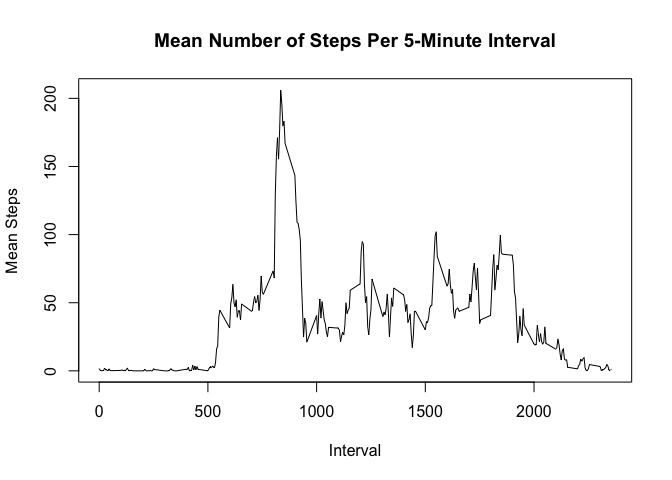

## Loading and preprocessing the data

```r
unzip("./activity.zip")
activity <- read.csv("activity.csv",header=TRUE)
```

## What is the mean total number of steps taken per day?

```r
totalsteps <- aggregate(activity$steps,by = list(activity$date),sum)
names(totalsteps) <- c("Date","totalsteps")
hist(totalsteps$totalsteps,breaks=15,
    main="Histogram: Total Steps Per Day",xlab="Total Steps Per Day")
mn <- mean(totalsteps$totalsteps,na.rm=TRUE)
mdn <- median(totalsteps$totalsteps,na.rm=TRUE)
abline(v=mn,col="green",lwd=3)
abline(v=mdn,col="blue",lwd=1.5)
```

<!-- -->
  
The <span style="color: green;">**mean (10766.19)**</span> and <span style="color: blue;">**median (10765)**</span> total number of steps taken per day are shown in green and blue, respectively, in the histogram above. 

## What is the average daily activity pattern?

```r
intervalsteps <- aggregate(activity$steps,by=list(activity$interval),mean,na.rm=TRUE)
names(intervalsteps) <- c("interval","mean.steps")
plot(intervalsteps$interval,intervalsteps$mean.steps,type="l",
     xlab="Interval",ylab="Mean Steps",
     main="Mean Number of Steps Per 5-Minute Interval")
```

<!-- -->
  
The 5-minute interval which, on average across all the days in the dataset, contains
the maximum number of steps is **835**.

## Imputing missing values
The total number of missing values in the dataset is **2304**.  

My strategy for replacing NA is to use the mean for the given 5-minute interval (mean
across all days). The new dataset is called "act2".

```r
act2 <- merge(activity,intervalsteps,by="interval")
act2$steps[is.na(act2$steps)] <- as.numeric(act2$mean.steps[is.na(act2$steps)])
act2 <- act2[,1:3]

totalsteps <- aggregate(act2$steps,by = list(act2$date),sum)
names(totalsteps) <- c("Date","totalsteps")
hist(totalsteps$totalsteps,breaks=15,
    main="Histogram: Total Steps Per Day (After Imputing)",xlab="Total Steps Per Day")
mn <- mean(totalsteps$totalsteps,na.rm=TRUE)
mdn <- median(totalsteps$totalsteps,na.rm=TRUE)
abline(v=mn,col="green",lwd=3)
abline(v=mdn,col="blue",lwd=1.5)
```

<!-- -->

The <span style="color: green;">**mean (10766.19)**</span> and <span style="color: blue;">**median (10766.19)**</span> total number of steps taken per day are shown in green and blue, respectively, in the histogram above.  

The median value is different than those obtained without imputing.  But the mean value is the same.


## Are there differences in activity patterns between weekdays and weekends?

```r
wknd <- weekdays(as.Date(as.character(act2$date))) %in% c("Saturday","Sunday")
act2$wkd <- rep("weekday",nrow(act2))
act2$wkd[wknd] <- "weekend"

library(lattice)
```

```
## Warning: package 'lattice' was built under R version 3.6.2
```

```r
with(aggregate(list(steps = act2$steps),by=list(wkd = act2$wkd,interval = act2$interval),mean), xyplot(steps~interval | wkd, layout=c(1,2), type="l"))
```

<!-- -->

